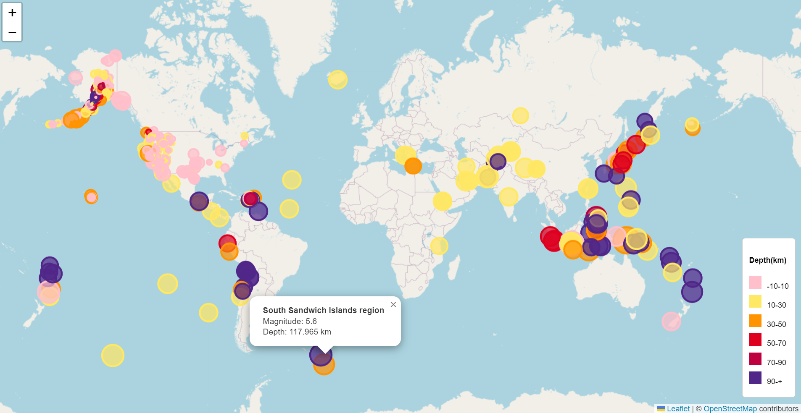

# leaflet-challenge

Title: Enhancing Earthquake Visualization for the United States Geological Survey (USGS)

Introduction:
The United States Geological Survey (USGS) plays a critical role in understanding natural hazards, ecosystem health, and climate impacts. As part of its mission, the USGS collects extensive data on global seismic activity. However, the challenge lies in effectively visualizing this data to educate the public and inform government organizations about seismic events worldwide. In response, this report outlines the development of a comprehensive earthquake visualization tool aimed at addressing this need.

Part 1: Creating the Earthquake Visualization:

The first phase of the project involved acquiring earthquake data from the USGS GeoJSON Feed page. This dataset, updated every 5 minutes, provided a rich source of information on seismic events globally. Leveraging the Leaflet mapping library, we crafted an interactive map to plot earthquake locations based on latitude and longitude coordinates.

To enhance the visualization, markers were dynamically sized and colored to reflect the magnitude and depth of each earthquake. This allowed users to intuitively grasp the severity and geographic distribution of seismic events. Furthermore, interactive popups were integrated to provide detailed information about individual earthquakes upon user interaction.

A crucial aspect of the visualization was the inclusion of a legend, providing context for the map's data. This legend elucidated the relationship between color and earthquake depth, facilitating interpretation for users.

Part 2: Gathering and Plotting More Data (Optional) (to be completed at a later date)
In the optional second phase of the project, we sought to enrich the earthquake visualization by incorporating data on tectonic plate boundaries. This additional layer of information aimed to illustrate the relationship between tectonic activity and seismic events, offering deeper insights into Earth's dynamic processes.

To achieve this, we obtained tectonic plate boundary data from external sources and seamlessly integrated it into the existing visualization. Users were provided with multiple base map options, allowing them to tailor the backdrop to their preferences. Layer controls were implemented to enable users to toggle the visibility of earthquake data and tectonic plate boundaries independently, enhancing exploration and analysis capabilities.

Conclusion:
The development of the earthquake visualization tool represents a significant step forward in visualizing seismic activity for the USGS. By leveraging interactive mapping techniques and incorporating additional data layers, we have created a powerful tool for educating the public and informing government organizations about seismic events worldwide. This tool not only enhances scientific understanding but also promotes awareness and facilitates informed decision-making in addressing Earth's dynamic processes.